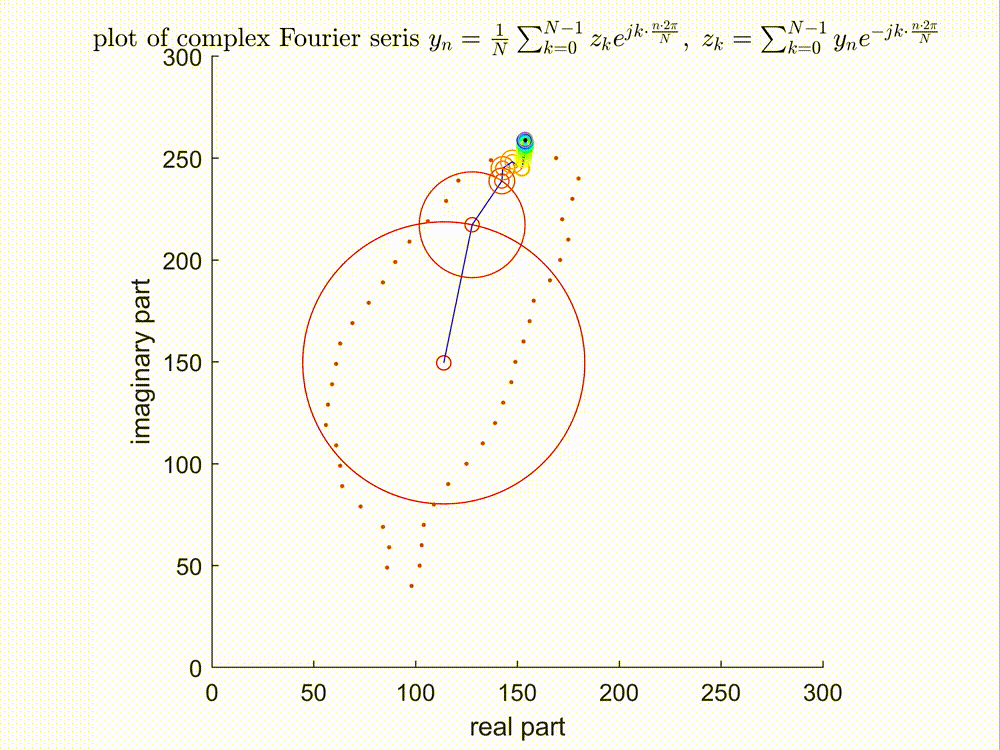
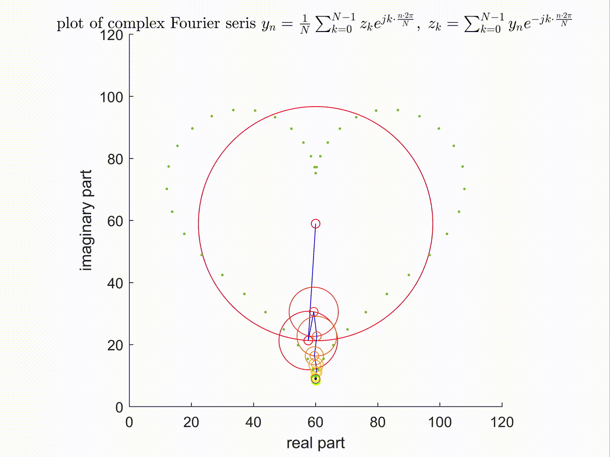
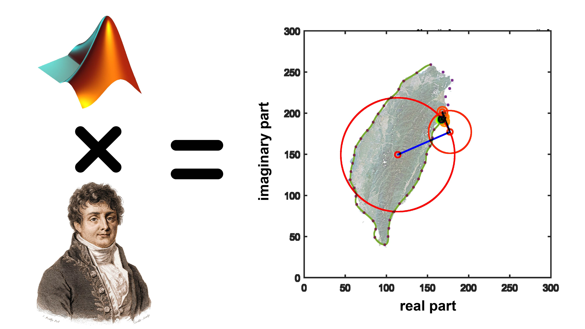
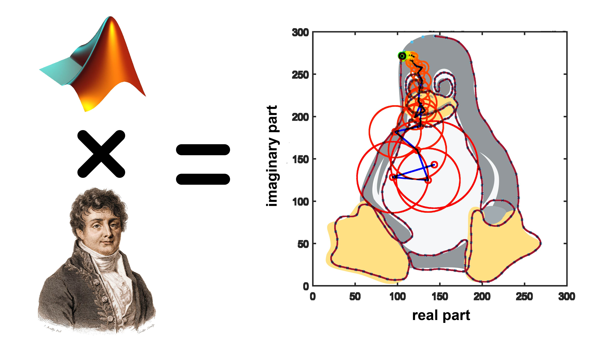

# Plot of Complex Fourier Series
Time : 2022 summer

## GIF demo
- 台灣

- 愛心
  
- Linux企鵝(Tux)


## Youtube demo 影片
- 愛心、台灣
[](https://www.youtube.com/watch?v=HWdtHzJKJbM)
- Linux企鵝(Tux)
[](https://www.youtube.com/watch?v=Ir2R0Tzbl70)

## 課程

|科目|教授|
|:-:|:-:|
|模組化課程[生理訊號之傅氏分析、應用與實作](https://modular-course.web2.ncku.edu.tw/var/file/100/1100/img/176656498.pdf)(可抵免通識學分)|[舒宇宸](https://www.math.ncku.edu.tw/people/faculty.php?member=ycshu)|

## 檔案層級說明

|檔案|說明|
|---|---|
|`edge_detection.m`|讀入影像`taiwan.png`檔案，處理後輸出變數至`taiwan.mat`。|
|`heart_shape_sample.m`|生成愛心取樣點的程式，處理後輸出變數至`heart.mat`。|
|`linux_icon.m`|讀入座標位置`linux_icon.txt`檔案，處理後輸出變數至`linux_icon.mat`。|
|`fourier_plot.m`|複數傅立葉轉換畫圖的主程式。|

## 數學理論說明
梳理一下網路上討論複數傅立葉級數畫圖相關文章與影片的時間線
1. [Ptolemy and Homer (Simpson)](https://www.youtube.com/watch?v=QVuU2YCwHjw)阿根廷的教授畫出辛普森家族的荷馬·辛普森。
2. [How can I draw a Homer with epicycloids?](https://mathematica.stackexchange.com/questions/171755/how-can-i-draw-a-homer-with-epicycloids)在Stack Exchange/Mathematica子板上有人自問自答上面影片要如何用Mathematica實現，有附詳細的解題流程與Mathematica的代碼。
3. [Epicycles, complex Fourier series and Homer Simpson's orbit](https://www.youtube.com/watch?v=qS4H6PEcCCA)完整解釋上面影片與文章的觀念。
4. [用1000个卫星轨道画一只miku!](https://www.bilibili.com/video/av28374720)用process畫初音。
5. [But what is a Fourier series? From heat flow to drawing with circles](https://www.youtube.com/watch?v=r6sGWTCMz2k)，在Youtube平台上搜尋Fourier Series前幾名會是這部影片，3Blue1Brown擅長使用精美的動畫講解數學的基本概念，使用自己開發的manim專案畫圖。

其中最值得看的是第3部與第5部影片，使用複數傅立葉畫圖大致概念可以想像在原始封閉的曲線，取樣足夠多的點足以"代表"這個封閉的曲線，將取樣點做FFT(DFT的一種快速演算法實現)，投影至不同旋轉頻率的單位圓所形成的"基底"所得的係數，將這些係數與其對應的基底相加，就可以合成出原始的訊號。
$$f(t) = \sum^\infty_{k = -\infty}c_ke^{jk\omega_0t} \qquad\text{where}\; c_k = \frac{1}{T}\int_Tf(t)e^{-jk\omega_0t}dt$$
$f(t)$為實數時傅立葉係數會共軛，做訊號重建時代表單位圓正轉與反轉的速率相同，因此相互抵銷，合成出來的訊號只會在實數軸移動；當$f(t)$為複數時，單位圓正轉與反轉不會相互抵銷，會在複數平面上畫出以上demo的動畫。

## 台灣圖取樣
輸入為一張黑白的`taiwan.png`圖檔，要偵測邊緣的話，最直覺的想法就是對影像取gradient，找最大值
$$\underset{j \in 1,\; 2,\; \ldots,\; \text{image length}}{\underset{i \in 1,\; 2,\; \ldots,\; \text{image width}}{\arg \max}} \{\nabla I(x_i,y_j) \}$$
由於有數值的部分橫跨好幾10個pixel，在取路徑與取樣點十分麻煩。觀察台灣影像具有"狹長的邊緣"這個特性，所以我使用針對特定問題、相對粗糙的方法取點，從影像最左邊往右移找到非0的index記錄下來，同理影像最右邊往左移找到非0的index記錄下來，代表是取樣點，一共取了44個點。

## 愛心圖取樣
參考[HeartCurve](https://mathworld.wolfram.com/HeartCurve.html)各種愛心方程式，最後選定
$$x(t) = 16\sin^3(t)$$
$$y(t) = 13\cos(t) - 5\cos(2t) - 2\cos(3t) - \cos(4t)$$
選擇這個方程式的原因有兩個 - 一是主觀認知這個圖形的形狀最符合愛心形狀，二是$x,y$座標表示可以用單一參數$t$，在matlab上比較好實現。

```matlab
t = linspace(-pi,pi, 50);
```
上述方程式在$t \in (-\pi, \pi)$區間為一週期，而我將這區間內分為50點數據，代表在愛心方程式上有50個取樣點。

## Linux企鵝(Tux)取樣
以下有2個棘手的最佳化問題

1. 選擇怎樣的封閉路徑才能最能代表原始圖形?也就是說該封閉路徑具有能讓一般人識別出原圖形的特徵。
2. 要對選定的封閉路徑上哪裡取樣?選擇最少的取樣點，在訊號重建時最能還原出原本封閉的路徑。

第一個問題可以參照[mathematica論壇的討論串](https://mathematica.stackexchange.com/questions/171755/how-can-i-draw-a-homer-with-epicycloids)，識別一張影像邊緣，再對邊緣路徑呼叫"尋找最短的旅程"的演算法，這個方法雖能自動化，但卻難以用計算機做最佳化出光滑而最能代表原圖形的路徑，畢竟光是人自己都無法自己立刻看出，因此我選擇自行規劃一條封閉一筆畫的路徑，使用商業繪圖軟體illustator，匯入一張要畫的參考圖並把其透明度調低，放在最後圖層並鎖定，再開個新的圖層，使用鋼筆工具用貝茲曲線自己想好畫封閉路徑，如下圖所示

之後再把路徑變成每次間隔5 pixel的取樣點，將檔案用Photoshop開啟，為了使路徑剛好只對應到一個pixel大小，鎖定工作範圍為$300 \times 300$個pixel大小，並打開`Window` -> `Info`，該功能為 - 滑鼠hover到圖片的一像素點就可以顯示該位置的x, y絕對座標，人工一個一個紀錄下來每個點的位置，花了快2個小時，總共取了438個點，另存為`linux_icon.txt`文字檔。

```matlab
data = readmatrix("linux_icon.txt");
data(:,2) = 300 - data(:,2); % invert y axis
pos_de = [data(1:3:49,:)', data(51:2:252,:)', data(253:341,:)',data(341:2:375,:)', data(376:3:end,:)']';
pos = pos_de';
save('linux_icon.mat','pos');
```
讀檔`linux_icon.txt`文字檔，由於Photoshop座標是從右上開始，matlab座標是從右下開始，所以需要反轉y座標，再來**縮減取樣點，大原則是較平滑的地方要減少取樣點**，因此我改一些區段為每過2、3個點才取一次，減少取樣點至246個點。

## 畫圖主程式
```matlab
%% input by given position
clc, clear, close all;
% L_Max = 300;
% L_Max = 120;
L_Max = 300;
axis equal; % for circle
axis([0, L_Max, 0, L_Max]);
ax = axis;
hold on;

% load('taiwan.mat');
% load('heart.mat');
load('linux_icon.mat');
Q = pos;
N = length(pos);
```
固定x與y軸等距離，使圖形長寬一致，才能圓才能看起來像"圓"。變數`Q`格式為
$$Q = [(x_1,y_1)^T, (x_2,y_2)^T, \cdots ,(x_{N},y_{N})^T]$$
```matlab
%% covert to complex
C = hsv(N); % color mapping
x = Q(1,:);
y = Q(2,:);
P = x + y*1i;
Z = fft(P);
Z = Z/N; % scaling
```
全色階拆成`N`等分，即為`N`種顏色，將`x`與`y`向量組合成複數向量`P`，做FFT再乘上一個$\frac{1}{N}$的scaling。
```matlab
%% sorting by radius
r = abs(Z(2:end)); % radius
k = [1:N/2, -N/2+1:-1];
q = 2:N;
[r, id] = sort(r,'descend');
k = k(id);
q = q(id);
```
除了第1筆數值(代表所有點的平均數，旋轉頻率為0的圓)之外，提取第2筆到最後一筆數據，由複數平面轉極座標$z = x + iy = |z|(\cos\theta + \sin\theta) = |z|e^{i\theta}$，根據複數的半徑大小進行排序，`k`代表單位圓旋轉的頻率，假設有`N = 5`代表4個單位圓非0的旋轉頻率，即是$1, 2, -2, -1$，假設`N = 6`代表有5個單位圓非0的旋轉頻率，即是$1, 2, 3, -2, -1$或是$1, 2, -3, -2, -1$，其中要決定$+3$或是$-3$頻率轉都可以，這邊代碼我是選擇要讓$-3$的頻率轉；`q`代表提取矩陣的index。
```matlab
%% plot
t = 0:2*pi/(5*N):2*pi;
trace = [];
for n = 1:length(t)
    z0 = Z(1);
    for j = 1:length(k) - 5 % sum of all wave number k
        plot(x, y, '.');
        hold on;
        plot(real(trace), imag(trace));
        plot(real(z0), imag(z0),'o','color',C(j,:)); % center of circle
        plot(real(z0) + r(j)*cos(t), imag(z0) + r(j)*sin(t),'color',C(j,:)); % circle 1
        axis equal
        title('plot of complex Fourier seris $y_n = \frac{1}{N}\sum^{N - 1}_{k = 0} z_k e^{jk\cdot \frac{n \cdot 2\pi}{N}},\; z_k = \sum^{N - 1}_{k = 0} y_n e^{-jk\cdot \frac{n \cdot 2\pi}{N}}$','Interpreter','latex','LineWidth',20);
        xlabel('real part','LineWidth',15);
        ylabel('imaginary part','LineWidth',15);
        axis(ax);
        z1 = z0 + Z(q(j))*exp(1i*k(j)*t(n));
        plot([real(z0), real(z1)], [imag(z0), imag(z1)],'b-'); % line from circle 1 to circle 2
        z0 = z1;
    end
    plot(real(z0), imag(z0), 'o');
    plot(real(z0), imag(z0), 'k.-');
    trace(n) = z0;
    hold off;
%     filename = ['fourier_plot_taiwan',num2str(n), '.png'];
%     filename = ['fourier_plot_heart',num2str(n), '.png'];
    filename = ['fourier_plot_linux_icon',num2str(n), '.png'];
    print(gcf,filename,'-dpng','-r600'); 
%     pause(0.01);
end
```
$$\int^{2\pi}_0 [Z(1) e^{i \cdot 0t} + Z(2) e^{i \cdot 1t} + Z(3) e^{i \cdot 2t} + \ldots + Z(\frac{N}{2} + 1) e^{i \cdot \frac{N}{2}t} +$$
$$Z(\frac{N}{2} + 2)e^{i \cdot (-\frac{N}{2} + 1)t} + Z(\frac{N}{2} + 3)e^{i \cdot (-\frac{N}{2} + 2)t} + Z(N)e^{i \cdot (-1)t}] dt$$
使用離散的數值運算去逼近上式的連續型，將各個單位圓相加，實際上就是藉由分解後的基底函數做原始訊號重建的過程 - 首先`z0 = Z(1)`數值為平均數，加上前面代碼所排序出最大的單位圓`z1 = z0 + Z(q(1))*exp(1i*k(1)*t(n))`，一直加到`j = 1:length(k) - 5`為止，扣除5的原因是把半徑最小的5筆單位圓去除，讓曲線更平滑。

---

由於matlab即時render每一張圖的速度太慢，為了方便demo，將每一張圖都存為改存為`*.png`點陣圖檔，指令為
```matlab
filename = ['fourier_plot_heart',num2str(n), '.png'];
print(gcf,filename,'-dpng','-r600'); 
```
首先第一行檔案名稱是將每一張圖片的後綴檔名都以數字循序增加，這樣剪輯軟體Adobe Premiere Pro才可以一次讀入image sequence；第二行`'-dpng'`為以PNG 24-bit格式儲存，`'-r600'`為指定600DPI儲存，以我這台顯示器15.4吋下去考量，實際像素點為$3500 \times 2625$，大致符合我想要輸出4K影片$3840 \times 2160$的解析度。